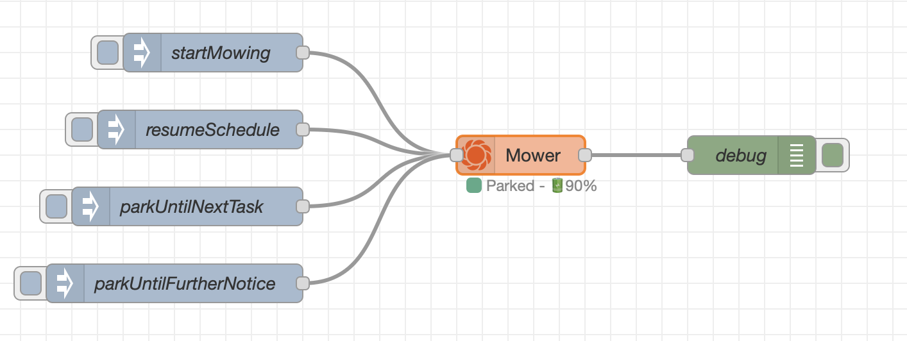

# node-red-contrib-gardena-smart-mower
Nodes for controlling and monitoring Gardena smart system enabled mowers.
Tested on a 2023 smart SILENO city, 600 m².

## Getting started

### 1. Get developer access
1. Create an account on the [Husqvarna developer website](https://developer.husqvarnagroup.cloud/apis/gardena-smart-system-api)
2. Create a new application
    - Application name: Your choice
    - Description: Can be left empty 
    - Redirect URLs: `http://localhost` (Doesn't matter because we won't use it)
3. Connect correct API's to your newly created application (Big orange button: 'Connect new API')
    - Authentication API
    - GARDENA smart system API
4. Use Application key and secret in the configuration of this node as `Client ID` and `Client Secret`

### 2. Install the nodes in your palette
1. Go to 'Manage palette' in the menu of node-red
2. Go to the 'Install' tab
3. Search for `node-red-contrib-gardena-smart-mower`
4. Install the nodes

### 3. Configure the mower & config node
1. Drag a 'Gardena Mower' node on your flow
2. Create a new 'Gardena configuration'
3. Enter the previously acquired Client ID & Client Secret
4. Click the search button to scan for 'locations'
5. Select the appropriate location
6. Save the 'Gardena configuration'
7. Click the search button to scan for 'mowers'
8. Select the appropriate mower
9. Save your node
10. Go!

## Using the mower node

### Receiving updates from the mower
When a status update is available for the Gardena smart system mower, a new message is sent:
- msg.mower: id & name of the mower
- msg.payload: latest values of all attrbutes
    - state
    - stateTs
    - activity
    - activityTs
    - lastErrorCode
    - lastErrorCodeTs
    - operatingHours
    - batteryLevel
    - batteryLevelTs
    - batteryState,
    - batteryStateTs
    - rfLinkLevel
    - rfLinkLevelTs
    - rfLinkState
- msg.updatesList: list of attributes which have been updated

### Commanding your mower
You can command the mower by sending a message with:
- msg.action:
    - resumeSchedule
    - startMowing
    - parkUntilFurtherNotice
    - parkUntilNextTask
- msg.duration: Optional duration in minutes (only for 'startMowing' action)

## Example flow

TODO: permalink